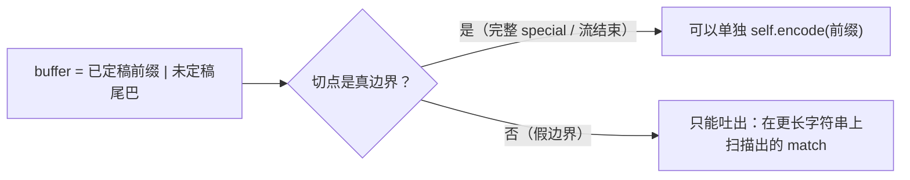

# 卡 32 · `[通用]` 真边界 / 假边界：切点两侧的决策各能"看到"多远

- **来源**：p11 `encode_iterable` 的读码讨论；卡 23 / 卡 24 的横向抽象
- **标记**：`[通用]` —— 不限于 BPE：任何把长输入切开的实现（流式、分块、按行、map-reduce）
  都要先问同一组问题

## 问题

`encode_iterable` 每一步手里只有 buffer，必须决定「哪一段已经定型」。读起来绕，是因为它同时
用了两套彼此独立的 hold：按**字符数**的 `hold`（special）和按 **match 个数**的
`pending`（pre-token），而这两套常数都没有在代码里写清依据。

## 两个概念

- **真边界**：切点两侧的文本在真实输入里本来就是分开处理的。这里有两处：完整 special 的
  两侧（`encode` 本来就按 special 切开再逐段 pre-tokenize）、以及流结束时的文本末尾。
- **假边界**：只是实现随手切出来的位置，比如「已定稿前缀的末尾」。
  **两侧结果之和必须等于整段结果，这需要单独论证。**


（若渲染器不支持 mermaid，读上面两行文字即可。）

## 正面 —— 预测两条 findall 的差异

```python
text = "\t\n>"
regex.findall(PAT, text[:2])   # 假边界：把 prefix 截出来重新扫
regex.findall(PAT, text)      # 整段
```

## 答案

```
"\t\n"   -> ['\t\n']              # 末尾变成字符串结尾，(?!\S) 成立，空白 run 被整个吞掉
"\t\n>"  -> ['\t', '\n', '>']     # 后面有非空白，(?!\S) 不成立，回退一格
```

同一个前缀，两种切法。**在假边界处"先截出前缀再重新扫"是错的**，必须直接吐出扫描时没碰到
边界的那个 match（`p11_tokenizer.py` 里的 `pending`）。

规则：

> 真边界处可以单独重新编码；假边界处只能吐出**在更长字符串上扫描得到的** match。

## hold 常数的系统推导

不要背"2"，按两条量化的规则推：

1. **看穿距离 K**：一个 match 的决策最远读到它自己结尾之后 K 个字符。
   - `\s+(?!\S)`：贪心吃下整个空白 run 后要看**下一个**字符 → K = 1；
   - `'(?:[sdmt]|ll|ve|re)`：要看到 `'` 之后的第 2 个字母才知道能不能成立 → 失败时读到结尾后 1；
   - ` ?\p{L}+` 的 ` ?`：要看到下一个字符才知道空格该不该吸附 → 失败时读到结尾后 1。
   - 分支取最大，本例 K = 1（可用穷举验证）。
2. **切开会变多**：一个 match 被截断最多变成 2 个 match（`'` + 残留字母）。

→ hold 的 match 数 = **K + 1**；本例 K = 1，所以是 2（卡 23 的"最后 2 个"）。
K = 1 是紧的：相邻两个长度 1 的 match（`'` + `\n` / `\n` + `\n`）能让"倒数第二个"也不安全。

验证紧性最便宜的做法是做 K = 1 / 2 两版常数对拍：

```sh
uv run python /tmp/p11_ablate.py     # 留 1 个 match 时在 ["You'r", "e"] 上出错
```

（`/tmp/p11_ablate.py` 是我写的临时脚本，随时可重建。）
BPE 里另有两条常量级的 hold（一个 special 最长 `max_special_len` 字符、一个 pre-token
可能很长）——那是**边界长度**给的，与 K 的**看穿距离**是两回事，别混。

## 消融：先破除，再看谁跳出来

这是分析边界条件最有用的一招。把守卫逐个拆掉，看哪个反例跳出来：

```sh
uv run python /tmp/p11_ablate.py
```

输出（"机制 / 反例 / 结果"）：

| 拆掉的机制 | 反例 | 症状 |
|---|---|---|
| 完全不缓冲，每块单独 encode | `["hel", "lo"]` | `hel` + `lo` ≠ `hello` |
| `hold = 0`（不 hold special 半截） | `["<|x|", ">"]` | special 被当普通文本 |
| special 不检查 `pos < safe_cut` | `["<|x|>", "<|x|>"]`（重叠 special） | 该合成一个长 special，却切成两个 |
| `pending` 只留 1 个 match | `["You'r", "e"]` | `'` 被提前 emit，contraction 拆开 |

反过来，"这个守卫看起来多余"是最危险的感觉（卡 13）：要拆掉它，让反例自己跳出来，
而不是靠觉得。

## 自测

```sh
uv run python - <<'PY'
import regex
from cs336_basics.p9_bpe_tokenizer_training import PAT

text = "\t\n>"
for cut in (2, 3):
    label = "完整" if cut == len(text) else "前缀"
    print(f"{label} {text[:cut]!r:>8} -> {regex.findall(PAT, text[:cut])}")
PY
```

遮住答案先猜：应该输出 `前缀 '\t\n' -> ['\t\n']` 和 `完整 '\t\n>' -> ['\t', '\n', '>']`。

## 手写要点

1. 切任何输入前，先给切点分类：**真边界**还是**假边界**。假边界处不允许"截出前缀重新处理"。
2. 逐条列出「哪些决策能跨过假边界」，每条问它**最远读到哪**（K），hold 常数由 K 推出来。
3. 边界长度（special 最长多少字符、pre-token 可能多长）与看穿距离 K 是两种来源，分开记。
4. 验收判据只有逐元素对拍；判对拍有效性的办法是**消融**。
5. 想让对拍灵敏，让探针 tokenizer 暴露 pre-token 边界（直接比较边界，而不是比较 ID）——
   不同的切分有时会碰巧得到相同 ID，只对拍 ID 会漏（卡 25）。

## 相关卡

- [卡 23](23-streaming-hold-multi-char-alternative.md) —— "2" 不够的原始教训
- [卡 24](24-whitespace-runs-cross-chunks.md) —— `\s+(?!\S)` 造成的非局部边界
- [卡 13](13-two-fixes-stacked.md) —— 守卫别叠两个；卡 25 —— 绿测试不等于在测
